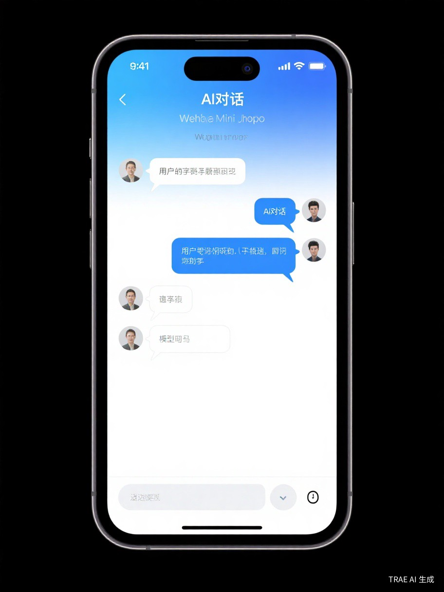
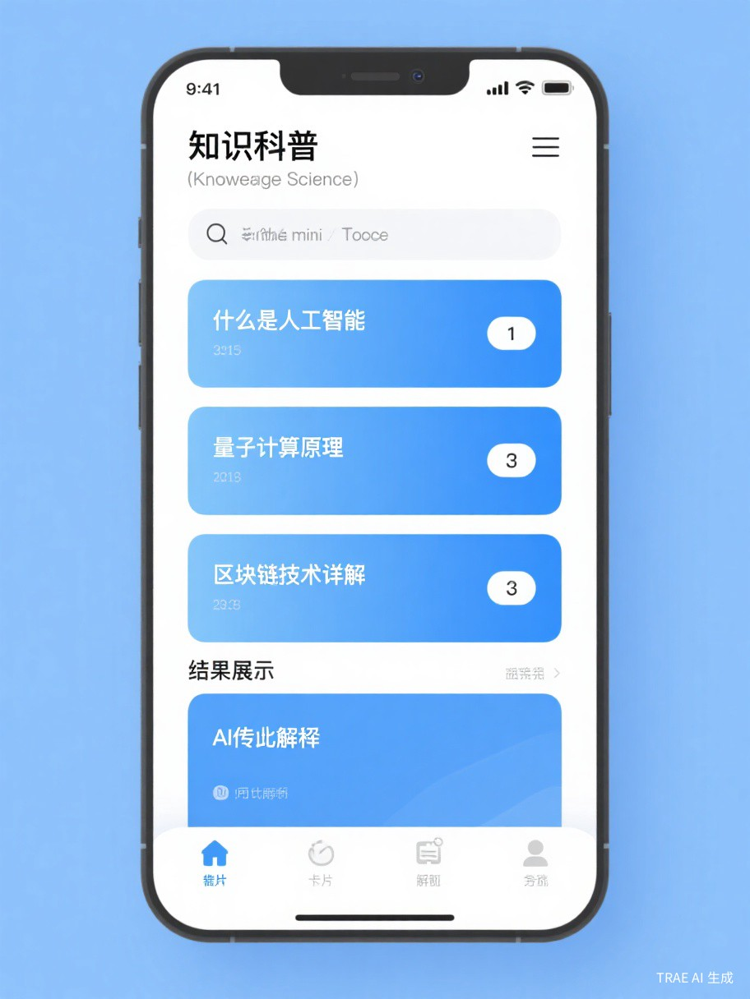

<p align="center">
  
  
  
</p>

<h1 align="center">识界AI (Shijie AI)</h1>

<p align="center">
  <b>基于微信生态的AI智能助手平台</b><br>
  支持100+ AI模型 · 智能对话 · 专业工具 · 一键部署
</p>

<p align="center">
  <a href="#-功能特性">功能特性</a> •
  <a href="#-项目架构">项目架构</a> •
  <a href="#-数据库设计">数据库设计</a> •
  <a href="#-技术栈">技术栈</a> •
  <a href="#-快速开始">快速开始</a> •
  <a href="#-api文档">API文档</a>
</p>

---

## 📱 预览

<p align="center">
  
  
  
</p>

## ✨ 功能特性

### 🤖 AI对话
- 支持100+主流AI模型（OpenAI、Claude、DeepSeek、通义千问等）
- 流式响应，实时输出
- 多轮对话上下文记忆
- 对话历史自动保存
- 多会话管理，支持切换和新建

### 🛠️ 专业工具

| 工具 | 描述 | 配置项 |
|------|------|--------|
| 💼 工作总结 | 智能生成工作总结 | 多岗位、多周期、多风格 |
| 🔬 知识科普 | AI科普知识解读 | 8大领域、3种难度 |
| 🎨 诗歌创作 | 创意诗歌生成 | 4种体裁、6种风格 |
| 📝 小红书文案 | 爆款文案生成 | 6种类型、4种风格 |
| 📧 邮件撰写 | 专业邮件模板 | 6种邮件类型 |
| 💻 代码解释 | 代码智能分析 | 8种语言、3种深度 |
| 📚 学习规划 | 个性化学习计划 | 智能规划算法 |
| 📦 产品描述 | 电商文案生成 | 产品详情模板 |

### 🔧 系统特性
- **动态提示词系统**：支持模板管理、版本控制、自动更新
- **微信一键登录**：基于微信OAuth2.0授权
- **用户反馈系统**：支持图片上传、状态跟踪
- **响应式UI设计**：适配各种屏幕尺寸
- **速率限制**：防止接口滥用
- **流式响应**：实时输出，提升用户体验

---

## 🏗️ 项目架构

### 目录结构

```
shijie-ai/
├── backend/                    # 后端服务
│   ├── app/
│   │   ├── api/               # API路由层
│   │   │   ├── auth.py        # 认证接口（微信登录）
│   │   │   ├── ai.py          # AI对话接口
│   │   │   ├── chat.py        # 聊天历史接口
│   │   │   ├── models.py      # AI模型管理接口
│   │   │   ├── prompts.py     # 提示词模板接口
│   │   │   ├── feedback.py    # 用户反馈接口
│   │   │   ├── upload.py      # 文件上传接口
│   │   │   ├── admin_auth.py  # 管理员认证接口
│   │   │   └── admin_data.py  # 管理员数据接口
│   │   ├── models/            # 数据模型层
│   │   │   ├── user.py        # 用户模型
│   │   │   ├── chat_history.py # 聊天历史模型
│   │   │   ├── prompt_template.py # 提示词模板模型
│   │   │   ├── feedback.py    # 反馈模型
│   │   │   ├── admin.py       # 管理员模型
│   │   │   └── system_config.py # 系统配置模型
│   │   ├── services/          # 业务逻辑层
│   │   │   ├── ai_service.py  # AI服务封装
│   │   │   └── prompt_service.py # 提示词服务
│   │   ├── core/              # 核心模块
│   │   │   └── logging.py     # 日志配置
│   │   ├── config.py          # 配置管理
│   │   ├── database.py        # 数据库连接
│   │   └── main.py            # 应用入口
│   ├── scripts/               # 脚本工具
│   ├── requirements.txt       # Python依赖
│   └── Dockerfile             # Docker配置
│
├── frontend/                   # 前端服务（uni-app）
│   ├── pages/                 # 页面目录
│   │   ├── index/             # 首页
│   │   ├── chat/              # AI对话页
│   │   ├── history/           # 历史记录页
│   │   ├── user/              # 个人中心页
│   │   ├── worksummary/       # 工作总结工具
│   │   ├── science/           # 知识科普工具
│   │   ├── poetry/            # 诗歌创作工具
│   │   ├── copywriting/       # 小红书文案工具
│   │   ├── email/             # 邮件撰写工具
│   │   ├── codeexplain/       # 代码解释工具
│   │   ├── studyplan/         # 学习规划工具
│   │   └── productdesc/        # 产品描述工具
│   ├── api/                   # API封装
│   │   ├── cloud.js           # 云函数/AI接口
│   │   ├── database.js        # 数据库操作
│   │   ├── user.js            # 用户相关
│   │   └── prompts.js         # 提示词模板
│   ├── static/                # 静态资源
│   └── pages.json             # 页面配置
│
├── admin/                      # 管理员后台（Vue 3 + Ant Design）
│   ├── src/
│   │   ├── api/              # API接口
│   │   ├── components/        # 公共组件
│   │   ├── router/           # 路由配置
│   │   ├── stores/           # Pinia状态管理
│   │   ├── utils/            # 工具函数
│   │   └── views/            # 页面视图
│   │       ├── dashboard/     # 数据概览
│   │       ├── user/         # 用户管理
│   │       ├── chat/         # 对话记录
│   │       ├── feedback/     # 反馈管理
│   │       ├── prompt/       # 提示词管理
│   │       ├── system/       # 系统设置
│   │       └── login/        # 登录页
│   └── package.json
│
├── docs/                       # 文档目录
│   ├── DEPLOY.md              # 部署文档
│   └── images/                # 预览图片
│
├── README.md                   # 项目说明
├── CONTRIBUTING.md             # 贡献指南
├── CHANGELOG.md                # 更新日志
├── LICENSE                     # 开源协议
├── .env.example                # 环境变量模板
└── docker-compose.yml          # Docker编排
```

### 架构设计

```
┌─────────────────────────────────────────────────────────────┐
│                      微信小程序前端                           │
│                    (uni-app + Vue 3)                        │
└─────────────────────────┬───────────────────────────────────┘
                          │ HTTPS
                          ▼
┌─────────────────────────────────────────────────────────────┐
│                     Nginx 反向代理                           │
│                   (SSL + 负载均衡)                          │
└─────────────────────────┬───────────────────────────────────┘
                          │
                          ▼
┌─────────────────────────────────────────────────────────────┐
│                    FastAPI 后端服务                          │
│  ┌─────────────┐  ┌─────────────┐  ┌─────────────┐         │
│  │   API层     │  │  Service层  │  │  Model层    │         │
│  │  (路由)     │──│  (业务逻辑) │──│  (数据模型) │         │
│  └─────────────┘  └─────────────┘  └─────────────┘         │
└─────────────────────────┬───────────────────────────────────┘
                          │
          ┌───────────────┼───────────────┐
          ▼               ▼               ▼
┌─────────────┐  ┌─────────────┐  ┌─────────────┐
│  SQLite/    │  │   LiteLLM   │  │   微信API   │
│ PostgreSQL  │  │ (AI模型网关) │  │  (OAuth)    │
└─────────────┘  └─────────────┘  └─────────────┘
                        │
          ┌─────────────┼─────────────┐
          ▼             ▼             ▼
    ┌─────────┐   ┌─────────┐   ┌─────────┐
    │ OpenAI  │   │ 通义千问 │   │ DeepSeek│
    └─────────┘   └─────────┘   └─────────┘
```

---

## 🗄️ 数据库设计

### 表结构概览

| 表名 | 说明 | 主要字段 |
|------|------|----------|
| `users` | 用户表 | openid, nickname, avatar, token |
| `chat_histories` | 对话历史表 | user_id, title, preview, model_id |
| `chat_messages` | 对话消息表 | chat_id, role, content, time |
| `prompt_templates` | 提示词模板表 | template_key, category, template_content |
| `prompt_template_history` | 模板历史表 | template_id, old_content, new_content |
| `dynamic_prompts` | 动态提示词缓存 | cache_key, prompt_content, expires_at |
| `feedbacks` | 用户反馈表 | user_id, type, content, status |
| `admins` | 管理员表 | username, password_hash, nickname, role, is_active |
| `admin_sessions` | 管理员会话表 | admin_id, token, expire_at |
| `system_configs` | 系统配置表 | config_key, config_value, config_type, description |

### 详细表结构

#### 1. users（用户表）

| 字段 | 类型 | 说明 |
|------|------|------|
| id | Integer | 主键，自增 |
| openid | String(64) | 微信用户唯一标识，索引 |
| union_id | String(64) | 微信开放平台UnionID |
| session_key | String(64) | 微信会话密钥 |
| nickname | String(64) | 用户昵称 |
| avatar | String(512) | 头像URL |
| phone | String(20) | 手机号 |
| token | String(256) | 登录令牌，索引 |
| token_expire | DateTime | 令牌过期时间 |
| is_active | Boolean | 是否激活 |
| created_at | DateTime | 创建时间 |
| updated_at | DateTime | 更新时间 |

#### 2. chat_histories（对话历史表）

| 字段 | 类型 | 说明 |
|------|------|------|
| id | Integer | 主键，自增 |
| user_id | Integer | 用户ID，外键，索引 |
| title | String(256) | 对话标题 |
| preview | String(512) | 最后一条消息预览 |
| model_id | String(64) | 使用的AI模型ID |
| model_name | String(128) | 模型名称 |
| is_deleted | Boolean | 是否已删除 |
| created_at | DateTime | 创建时间 |
| updated_at | DateTime | 更新时间 |

#### 3. chat_messages（对话消息表）

| 字段 | 类型 | 说明 |
|------|------|------|
| id | Integer | 主键，自增 |
| chat_id | Integer | 对话ID，外键，索引 |
| role | String(16) | 角色：user/assistant |
| content | Text | 消息内容 |
| time | String(16) | 消息时间 |
| created_at | DateTime | 创建时间 |

#### 4. prompt_templates（提示词模板表）

| 字段 | 类型 | 说明 |
|------|------|------|
| id | Integer | 主键 |
| template_key | String(100) | 模板唯一标识，索引 |
| category | String(50) | 分类，索引 |
| sub_key | String(100) | 子分类key |
| template_content | Text | 模板内容，支持{变量} |
| variables | JSON | 模板变量列表 |
| version | Integer | 版本号 |
| is_active | Integer | 是否启用 |
| generation_params | JSON | 生成参数 |
| description | String(500) | 模板描述 |
| usage_count | Integer | 使用次数 |
| created_at | DateTime | 创建时间 |
| updated_at | DateTime | 更新时间 |

#### 5. feedbacks（用户反馈表）

| 字段 | 类型 | 说明 |
|------|------|------|
| id | Integer | 主键 |
| user_id | Integer | 用户ID |
| type | String(20) | 类型：feature/bug/experience/other |
| content | Text | 反馈内容 |
| contact | String(100) | 联系方式 |
| images | JSON | 图片URL列表 |
| status | String(20) | 状态：pending/processing/resolved |
| reply | Text | 回复内容 |
| created_at | DateTime | 创建时间 |

#### 6. admins（管理员表）

| 字段 | 类型 | 说明 |
|------|------|------|
| id | Integer | 主键，自增 |
| username | String(64) | 用户名，唯一索引 |
| password_hash | String(256) | 密码哈希 |
| nickname | String(64) | 昵称 |
| role | String(32) | 角色 |
| is_active | Boolean | 是否激活 |
| last_login | DateTime | 最后登录时间 |
| created_at | DateTime | 创建时间 |
| updated_at | DateTime | 更新时间 |

#### 7. admin_sessions（管理员会话表）

| 字段 | 类型 | 说明 |
|------|------|------|
| id | Integer | 主键，自增 |
| admin_id | Integer | 管理员ID，外键，索引 |
| token | String(256) | 会话令牌，索引 |
| expire_at | DateTime | 过期时间 |
| created_at | DateTime | 创建时间 |

#### 8. system_configs（系统配置表）

| 字段 | 类型 | 说明 |
|------|------|------|
| id | Integer | 主键，自增 |
| config_key | String(100) | 配置键，唯一索引 |
| config_value | Text | 配置值 |
| config_type | String(32) | 配置类型 |
| description | String(500) | 配置描述 |
| created_at | DateTime | 创建时间 |
| updated_at | DateTime | 更新时间 |

### ER图

```
┌──────────────┐       ┌──────────────────┐       ┌──────────────────┐
│    users     │       │  chat_histories  │       │  chat_messages   │
├──────────────┤       ├──────────────────┤       ├──────────────────┤
│ id (PK)      │◄──────│ user_id (FK)     │       │ id (PK)          │
│ openid       │       │ id (PK)          │◄──────│ chat_id (FK)     │
│ nickname     │       │ title            │       │ role             │
│ avatar       │       │ preview          │       │ content          │
│ token        │       │ model_id         │       │ time             │
└──────────────┘       └──────────────────┘       └──────────────────┘

┌──────────────────────┐
│   prompt_templates   │
├──────────────────────┤
│ id (PK)              │
│ template_key         │
│ category             │
│ template_content     │
│ variables (JSON)     │
│ version              │
└──────────────────────┘

┌──────────────────────┐       ┌──────────────────────┐
│       admins         │       │   admin_sessions     │
├──────────────────────┤       ├──────────────────────┤
│ id (PK)              │◄──────│ admin_id (FK)        │
│ username             │       │ id (PK)              │
│ password_hash        │       │ token                │
│ nickname             │       │ expire_at            │
│ role                 │       └──────────────────────┘
│ is_active            │
│ last_login           │       ┌──────────────────────┐
└──────────────────────┘       │   system_configs     │
                               ├──────────────────────┤
                               │ id (PK)              │
                               │ config_key           │
                               │ config_value         │
                               │ config_type          │
                               │ description          │
                               └──────────────────────┘
```

---

## 🛠️ 技术栈

### 前端技术

| 技术 | 版本 | 说明 |
|------|------|------|
| uni-app | Vue 3 | 跨端开发框架 |
| Vue 3 | 3.x | 渐进式JavaScript框架 |
| SCSS | - | CSS预处理器 |
| 微信小程序API | - | 微信原生能力 |

### 后端技术

| 技术 | 版本 | 说明 |
|------|------|------|
| FastAPI | 0.100+ | 高性能Web框架 |
| SQLAlchemy | 2.0+ | ORM框架 |
| LiteLLM | 1.0+ | AI模型统一网关 |
| Pydantic | 2.0+ | 数据验证 |
| slowapi | - | 速率限制 |
| uvloop | - | 高性能事件循环 |

### 数据库

| 数据库 | 场景 |
|--------|------|
| SQLite | 开发环境 |
| PostgreSQL | 生产环境（推荐） |
| MySQL | 生产环境（可选） |

---

## 🚀 快速开始

### 环境要求
- Python 3.9+
- Node.js 16+
- HBuilderX (前端开发)

### 1. 克隆项目

```bash
git clone https://github.com/jingshaoyi/shijie-ai.git
cd shijie-ai
```

### 2. 后端配置

```bash
cd backend

# 创建虚拟环境
python -m venv venv
source venv/bin/activate  # Windows: venv\Scripts\activate

# 安装依赖
pip install -r requirements.txt

# 配置环境变量
cp .env.example .env
# 编辑 .env 文件，配置你的API密钥

# 初始化数据库
python -c "from app.database import engine; from app.models import Base; Base.metadata.create_all(bind=engine)"

# 启动服务
python run.py
```

### 3. 前端配置

```bash
cd frontend

# 使用HBuilderX打开项目
# 配置 manifest.json 中的 appid
# 点击运行到微信小程序模拟器
```

### 4. 管理员后台（可选）

```bash
cd admin

# 安装依赖
npm install

# 开发模式运行
npm run dev
# 访问 http://localhost:5173

# 生产构建
npm run build
```

**默认管理员账号**: admin / admin123

管理员后台支持数据概览、用户管理、对话记录（可拖拽缩放、Token统计）、反馈管理、提示词管理、系统设置（AI模型配置、系统名称修改）

---

## 📦 部署指南

### 宝塔面板部署

1. **上传代码**到服务器
2. **安装Python环境** 3.9+
3. **安装依赖**: `pip install -r requirements.txt`
4. **配置Nginx**反向代理
5. **配置SSL证书**
6. **启动服务**: `gunicorn -c gunicorn.conf.py app.main:app`

详细部署文档: [DEPLOY.md](docs/DEPLOY.md)

### Docker部署 (可选)

```bash
docker-compose up -d
```

---

## 📚 API文档

### 接口列表

| 模块 | 接口 | 方法 | 说明 |
|------|------|------|------|
| 认证 | `/api/auth/wechat` | POST | 微信登录 |
| 认证 | `/api/auth/verify` | GET | 验证Token |
| AI | `/api/ai/chat` | POST | AI对话（流式） |
| AI | `/api/ai/models` | GET | 获取模型列表 |
| 聊天 | `/api/chat/history` | GET | 获取历史列表 |
| 聊天 | `/api/chat/history/{id}` | GET | 获取对话详情 |
| 聊天 | `/api/chat/save` | POST | 保存对话 |
| 提示词 | `/api/prompts/list` | GET | 获取模板列表 |
| 提示词 | `/api/prompts/render` | POST | 渲染模板 |
| 反馈 | `/api/feedback/submit` | POST | 提交反馈 |
| 上传 | `/api/upload/image` | POST | 上传图片 |

### 管理员接口

| 模块 | 接口 | 方法 | 说明 |
|------|------|------|------|
| 认证 | `/api/auth/admin/login` | POST | 管理员登录 |
| 认证 | `/api/auth/admin/info` | GET | 获取管理员信息 |
| 认证 | `/api/auth/admin/logout` | POST | 管理员登出 |
| 数据 | `/api/admin/statistics` | GET | 获取统计数据 |
| 数据 | `/api/admin/trend` | GET | 获取趋势数据 |
| 数据 | `/api/admin/model-stats` | GET | 模型使用统计 |
| 数据 | `/api/admin/activities` | GET | 最近活动 |
| 用户 | `/api/admin/users` | GET | 用户列表 |
| 用户 | `/api/admin/users/{id}` | GET | 用户详情 |
| 用户 | `/api/admin/users/{id}/status` | PUT | 更新用户状态 |
| 对话 | `/api/admin/chats` | GET | 对话列表 |
| 对话 | `/api/admin/chats/{id}` | GET | 对话详情 |
| 反馈 | `/api/admin/feedbacks` | GET | 反馈列表 |
| 反馈 | `/api/admin/feedbacks/{id}/reply` | PUT | 回复反馈 |
| 提示词 | `/api/admin/prompts` | GET/POST | 提示词列表/创建 |
| 提示词 | `/api/admin/prompts/{id}` | PUT/DELETE | 更新/删除提示词 |
| 提示词 | `/api/admin/prompts/{id}` | GET | 提示词详情 |
| 系统 | `/api/admin/models` | GET | 获取LLM模型列表 |
| 系统 | `/api/admin/settings` | GET | 获取系统设置 |
| 系统 | `/api/admin/settings/batch` | PUT | 批量更新设置 |
| 系统 | `/api/admin/notifications` | GET | 获取消息通知 |

### 在线文档

启动后端服务后访问:
- Swagger UI: `http://localhost:9090/docs`
- ReDoc: `http://localhost:9090/redoc`

---

## 🔑 环境变量

| 变量名 | 说明 | 必填 | 默认值 |
|--------|------|------|--------|
| `SECRET_KEY` | JWT密钥 | ✅ | - |
| `DASHSCOPE_API_KEY` | 阿里云DashScope API密钥 | ✅ | - |
| `OPENAI_API_KEY` | OpenAI API密钥 | ❌ | - |
| `DEEPSEEK_API_KEY` | DeepSeek API密钥 | ❌ | - |
| `ANTHROPIC_API_KEY` | Anthropic API密钥 | ❌ | - |
| `DATABASE_URL` | 数据库URL | ❌ | sqlite:///data/shijie_ai.db |
| `WECHAT_APPID` | 微信小程序AppID | ✅ | - |
| `WECHAT_SECRET` | 微信小程序Secret | ✅ | - |
| `UPLOAD_DIR` | 上传目录 | ❌ | uploads |
| `LOG_LEVEL` | 日志级别 | ❌ | INFO |

---

## 🤝 贡献指南

我们欢迎所有形式的贡献！

1. Fork 本仓库
2. 创建你的特性分支 (`git checkout -b feature/AmazingFeature`)
3. 提交你的修改 (`git commit -m 'Add some AmazingFeature'`)
4. 推送到分支 (`git push origin feature/AmazingFeature`)
5. 打开一个 Pull Request

详见 [CONTRIBUTING.md](CONTRIBUTING.md)

---

## 📄 开源协议

本项目基于 [MIT](LICENSE) 协议开源。

---

## 🙏 致谢

- [FastAPI](https://fastapi.tiangolo.com/) - 高性能Web框架
- [LiteLLM](https://github.com/BerriAI/litellm) - 统一AI模型调用
- [uni-app](https://uniapp.dcloud.io/) - 跨端开发框架
- [SQLAlchemy](https://www.sqlalchemy.org/) - Python ORM

---

## 📧 联系我们

- 邮箱: majic_jing@163.com
- GitHub: [https://github.com/jingshaoyi/shijie-ai](https://github.com/jingshaoyi/shijie-ai)

---

<p align="center">
  如果这个项目对你有帮助，请给个 ⭐ Star！
</p>
